# 数据库基础

本文整理数据库系统、关系模型、SQL、数据库设计与事务控制等基础知识。

## 数据库概述

### SQL 概述
> &nbsp;
> **SQL**，一般发音为 sequel，SQL 的全称 (Structured Query Language)，SQL 用来和数据库打交道，完成和数据库的通信，SQL是一套标准。
> &nbsp;


### 什么是数据库
> &nbsp;
> **数据库**，通常是==一个或一组文件，保存了一些符合特定规格的数据==,数据库对应的英语单词是 DataBase,简称:DB。
> 数据库软件称为**数据库管理系统**（DBMS），全称为 DataBase Management System，如：Oracle、SQL Server、MySql、Sybase、informix、DB2、interbase、PostgreSql。
> &nbsp;

### MySQL 概述
> &nbsp;
> **MySQL** 最初是由“MySQL AB”公司开发的一套==关系型数据库管理系统==（RDBMS-Relational Database Mangerment System）。
> MySQL 不仅是最流行的开源数据库，而且是业界成长最快的数据库，每天有超过 7 万次的下载量，其应用范围从大型企业到专有的嵌入应用系统。
> &nbsp;

### 数据库中的表
> &nbsp;
> 表(table)是一种结构化的文件，可以用来存储特定类型的数据，如：学生信息，课程信息，都可以放到表中。另外表都有特定的名称，而且不能重复。
> 表中具有几个概念：列、行、主键。 ==列叫做字段(Column)==，==行叫做表中的记录==,每一个字段都有:字段名称/字段数据类型/字段约束/字段长度。
> 表是数据库最基本的单元。
> 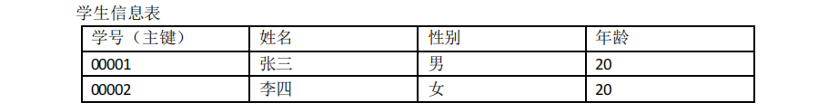
> &nbsp;

### SQL 的分类
> &nbsp;
> 数据查询语言(DQL-Data Query Language):**select**;
> ```sql
> select
>   '字段'
> from
>   '表名'
> where
>   '条件方程式'
> group by
>   '字段'
> having
>   '条件方程式'
> order by
>   '字段' desc/asc
> limit
>   '起始下标','长度';
> ```
> 数据操纵语言(DML-Data Manipulation Language):**insert**,**delete**,**update**;
> 数据定义语言(DDL-Data Definition Language):**create** ,**drop**,**alter**;
> 事务控制语言(TCL-Transactional Control Language):**commit** ,**rollback**;
> 数据控制语言(DCL-Data Control Language):**grant**,**revoke**;
> &nbsp;

---

## 连接查询
> &nbsp;
> **各表数据**
> 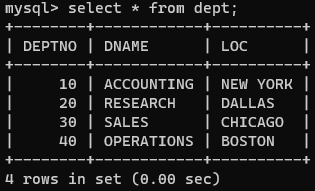 
> 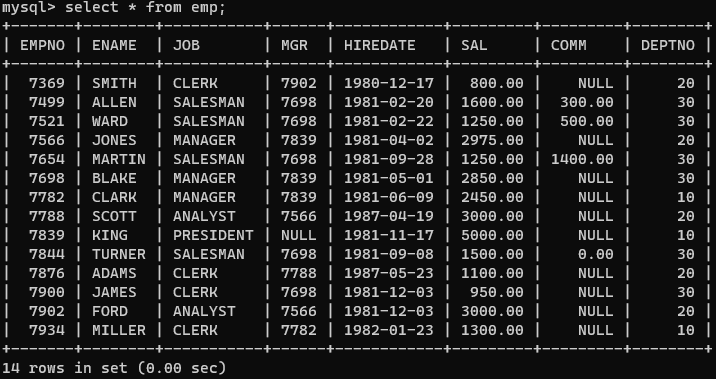
> 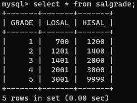
> 
> &nbsp;
> **内连接**（无主次关系）：
> &nbsp;
> * 等值连接
> ```sql
> select 
>   e.ename,d.dname 
> from 
>   emp as e 
> inner join 
>   dept as d 
> on 
>   e.deptno = d.deptno;
> ```
> 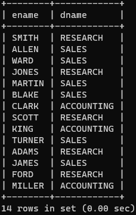
> &nbsp;
> * 非等值连接
> ```sql
> select
>   e.ename,e.sal,s.grade
> from
>   emp as e
> inner join
>   salgrade as s
> on
>   e.sal between s.losal and s.hisal;
> ```
> 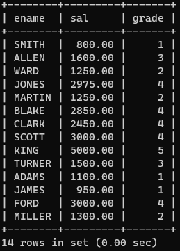
> &nbsp;
> * 自连接
> ```sql
> select
>   a.ename as '员工名',b.ename as '领导名'
> from
>   emp as a
> inner join
>   emp as b
> on
>   a.mgr = b.empno;
> ```
> 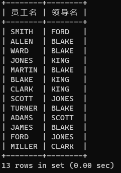
> &nbsp;
> 
> **外连接**（有主次关系）：
> &nbsp;
> * 左外连接
> ```sql
> select
>   e.ename,d.dname
> from
>   dept as d
> left outer join
>   emp as e
> on
>   e.deptno = d.deptno;
> ```
> &nbsp;
> * 右外连接
> ```sql
> select
>   e.ename,d.dname
> from
>   emp as e
> right outer join
>   dept as d
> on
>   e.deptno = d.deptno;
> ```
> 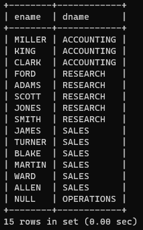
> &nbsp;
> **全连接**
> &nbsp;


&nbsp;
## MySQL 常用数据类型
| 类型 | 描述 |
| ---- | ---- |
| <center>Char(长度) | <center>定长字符串，存储空间大小固定，适合作为主键或外键 |
| <center>Varchar(长度) | <center>变长字符串，存储空间等于实际数据空间 |
| <center>double(有效数字位数，小数位) | <center>数值型 |
| <center>Float(有效数字位数，小数位) | <center>数值型 |
| <center>Int(长度) | <center>整型 |
| <center>bigint(长度) | <center>长整型 |
| <center>Date | <center>日期型 |
| <center>BLOB | <center>Binary Large OBject（二进制大对象） |
| <center>CLOB | <center>Character Large OBject（字符大对象） |


&nbsp;
## 表约束
> &nbsp;
> a) 非空约束：**not null**（数据不能为空）
> b) 唯一约束：**unique** （数据不能重复）
> * 列级约束(单一约束)
> * 表级约束(联合约束) （unique（'字段名','字段名'））
> 
> c) 主键约束：**primary key**(PK)（唯一标识）
> * 列级约束(单一主键)
> * 表级约束(复合主键) （unique（'字段名','字段名'））
> 
> d) 外键约束：**foreign key**(FK)
> &ensp;指令：foreign key('字段名') references '另一张表名'('字段名')
> &nbsp;


&nbsp;
## MySQL 常用存储引擎
> &nbsp;
> ### MyISAM 存储引擎
> MyISAM 存储引擎是 MySQL 最常用的引擎。
> 它管理的表具有以下特征：
> – 使用三个文件表示每个表：
> * 格式文件 — 存储表结构的定义（mytable.frm） 
> * 数据文件 — 存储表行的内容（mytable.MYD） 
> * 索引文件 — 存储表上索引（mytable.MYI） 
> 
> – 灵活的 AUTO_INCREMENT 字段处理
> – 可被转换为压缩、只读表来节省空间
> &nbsp;
> ### InnoDB 存储引擎
> InnoDB 存储引擎是 MySQL 的缺省引擎。
> 它管理的表具有下列主要特征：
> – 每个 InnoDB 表在数据库目录中以.frm 格式文件表示
> – InnoDB 表空间 tablespace 被用于存储表的内容
> – 提供一组用来记录事务性活动的日志文件
> – 用 COMMIT(提交)、SAVEPOINT 及 ROLLBACK(回滚)支持事务处理
> – 提供全 ACID 兼容
> – 在 MySQL 服务器崩溃后提供自动恢复
> – 多版本（MVCC）和行级锁定
> – 支持外键及引用的完整性，包括级联删除和更新
> &nbsp;
> ### MEMORY 存储引擎
> 使用 MEMORY 存储引擎的表，其数据存储在内存中，且行的长度固定，这两个特点使得 MEMORY 存储引擎非
常快。
>  MEMORY 存储引擎管理的表具有下列特征：
> – 在数据库目录内，每个表均以.frm 格式的文件表示。
> – 表数据及索引被存储在内存中。
> – 表级锁机制。
> – 不能包含 TEXT 或 BLOB 字段。
>  MEMORY 存储引擎以前被称为 HEAP 引擎。
> &nbsp;

## 数据库系统结构

数据库管理系统主要负责以下工作：

1. 数据定义：定义外模式、模式、内模式以及相应约束。
2. 数据操纵：提供数据检索和更新能力。
3. 数据控制：负责安全性、完整性、并发控制和故障恢复。
4. 数据维护：执行数据转储、恢复、重组和性能分析。
5. 通信：协调应用程序、用户与数据库之间的交互。

### 三级模式与两级映像

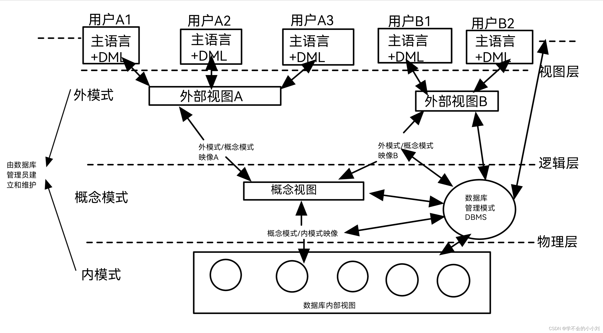

数据库系统采用三级模式结构：

1. **外模式**：用户能够看到和使用的局部数据逻辑结构。
2. **模式**：全体数据的逻辑结构及其关联约束，也称概念模式。
3. **内模式**：数据存储结构的描述，包括存储方式和索引方式等。

外模式与模式之间的映像保证逻辑独立性，模式与内模式之间的映像保证物理独立性。

## 关系模型

### 候选键、主键与外键

- **候选键**：能够唯一标识关系中元组，并且不含多余属性的属性集合。
- **主键**：从候选键中选定、用于标识元组的键。
- **外键**：一个关系中引用另一个关系主键的属性或属性集合。

### 完整性约束

- **实体完整性**：每个元组的主键值必须非空且唯一。
- **参照完整性**：外键值必须为空，或者等于被参照关系中的某个主键值。

## 常用 SQL 操作

### 创建表

```sql
create table 表名 (
    字段名 数据类型 约束,
    字段名 数据类型 约束
);
```

### 创建视图

```sql
create view 视图名 as
select 字段名
from 表名;
```

### 新增、删除与修改数据

```sql
insert into 表名 (字段名) values (值);

delete from 表名 where 条件;

update 表名 set 字段名 = 值 where 条件;
```

## 数据库设计

### E-R 模型

E-R 模型使用实体、属性和联系描述现实世界中的数据关系。

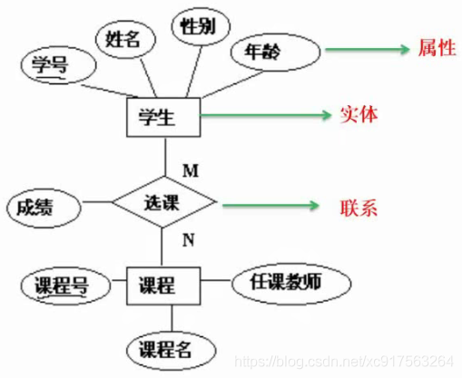

将 E-R 模型转换为关系模型时，需要把实体集转换为关系，并根据联系的类型确定外键或中间关系。

### 关系规范化

1. **第一范式**：每个字段都具有原子性，不能继续拆分。
2. **第二范式**：在第一范式基础上，非主属性完全依赖候选键，不能存在部分依赖。
3. **第三范式**：在第二范式基础上，非主属性不能传递依赖候选键。

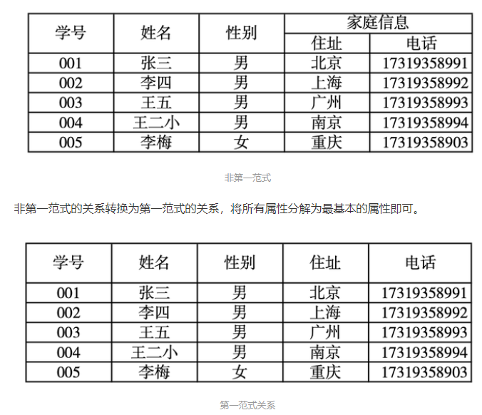

必要时可以通过模式分解消除不合理的依赖关系，将低级范式转换为高级范式。

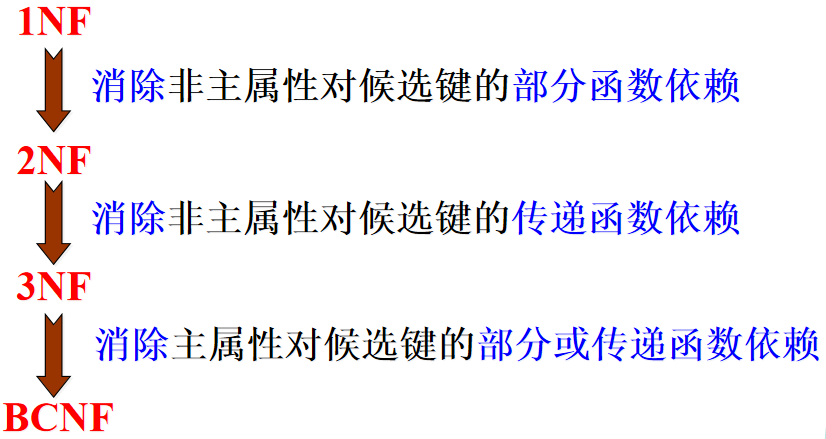

## 事务与并发控制

事务是数据库的逻辑工作单位，其中的一组操作要么全部完成，要么全部不执行。

常见并发问题包括：

- 丢失修改；
- 脏读；
- 不可重复读。

通过并发控制，可以保证事务的隔离性和数据一致性。基于封锁的三级协议分别解决不同问题：

1. 一级封锁协议：修改数据前加排他锁，直到事务结束，用于防止丢失修改。
2. 二级封锁协议：在一级协议基础上，读取数据前加共享锁，读取完成后释放，用于防止脏读。
3. 三级封锁协议：共享锁保持到事务结束，用于保证可重复读。

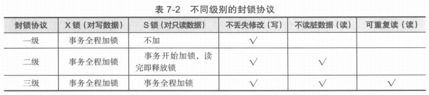

当事务长期等待资源时可能出现活锁，可以采用先来先服务的调度策略。多个事务相互等待对方持有的资源时会形成死锁，可以通过一次封锁、统一封锁顺序或撤销代价较小的事务进行预防或处理。


&nbsp;
